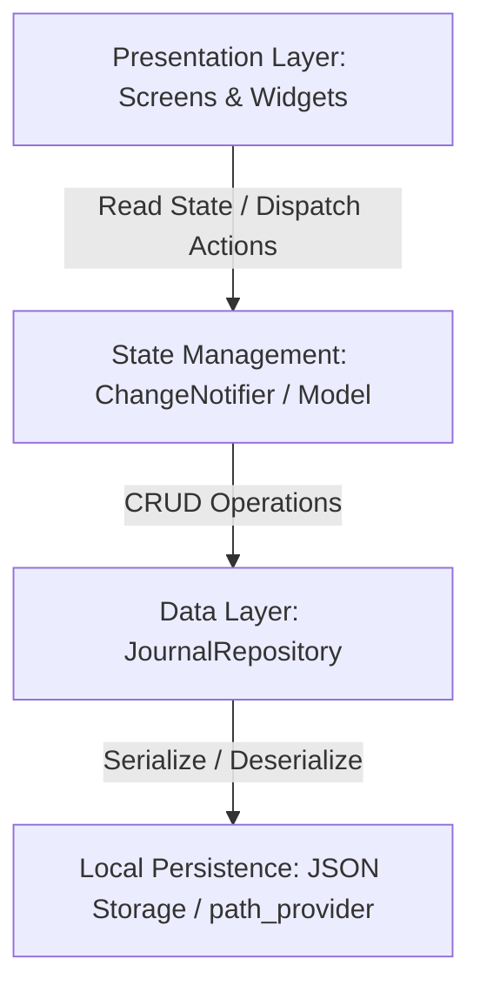

# Peejays - Technical Architecture Specification

This document details the software architecture, data modeling, state management, and persistence layer for the **Peejays** personal journaling application.

---

## 1. Core Architecture Model

Peejays is built as a single-device, offline-first client application using Flutter. The architecture follows a clean separation of concerns, dividing the app into UI (Presentation), Business Logic (State Management), and Data/Persistence layers.



---

## 2. Data Model Specification

A journal entry is represented internally using the following Dart model class. It supports serialization and deserialization to facilitate JSON-based local storage.

### Dart Model Implementation

```dart
import 'dart:convert';

class JournalEntry {
  final String id;
  final String title;
  final String content;
  final DateTime createdAt;
  final DateTime updatedAt;
  final List<String> tags;

  JournalEntry({
    required this.id,
    required this.title,
    required this.content,
    required this.createdAt,
    required this.updatedAt,
    required this.tags,
  });

  /// Creates a copy of this JournalEntry with some fields replaced.
  JournalEntry copyWith({
    String? title,
    String? content,
    DateTime? updatedAt,
    List<String>? tags,
  }) {
    return JournalEntry(
      id: this.id,
      title: title ?? this.title,
      content: content ?? this.content,
      createdAt: this.createdAt,
      updatedAt: updatedAt ?? this.updatedAt,
      tags: tags ?? this.tags,
    );
  }

  /// Converts a JSON Map to a JournalEntry instance.
  factory JournalEntry.fromJson(Map<String, dynamic> json) {
    return JournalEntry(
      id: json['id'] as String,
      title: json['title'] as String,
      content: json['content'] as String,
      createdAt: DateTime.parse(json['createdAt'] as String),
      updatedAt: DateTime.parse(json['updatedAt'] as String),
      tags: List<String>.from(json['tags'] as List),
    );
  }

  /// Converts a JournalEntry instance to a JSON Map.
  Map<String, dynamic> toJson() {
    return {
      'id': id,
      'title': title,
      'content': content,
      'createdAt': createdAt.toIso8601String(),
      'updatedAt': updatedAt.toIso8601String(),
      'tags': tags,
    };
  }
}
```

---

## 3. Persistence Layer (Local Storage)

Since Peejays is designed to run offline without external database servers, persistence is achieved through a JSON-based file storage system.

- **Storage Method**: The list of journal entries is serialized to a JSON array and saved to a file (`journal_entries.json`) in the application's document directory.
- **Directory Path**: Obtained using the `path_provider` package:
  - **Android**: `AppDocumentsDirectory` (internal sandbox storage)
  - **iOS**: `NSDocumentDirectory` (Documents folder)
  - **Desktop (macOS/Windows/Linux)**: User's application support directory.
- **Data Flow on Boot**:
  1. The application starts up and checks for the existence of `journal_entries.json`.
  2. If the file exists, it is read as a string, parsed as a JSON array, and mapped to a list of `JournalEntry` objects.
  3. If the file does not exist, an empty list is initialized and the file is created.

---

## 4. Business Logic & State Management

To maintain simplicity, Peejays utilizes a ChangeNotifier-based architecture (e.g., using the `Provider` or standard Flutter builder patterns) to manage the list of entries and filter states.

### State Controller (`JournalProvider`)
A central provider holds the state and provides methods to manipulate it:
- **State**:
  - `List<JournalEntry> _entries`: All loaded journal entries.
  - `String _searchQuery`: The active filter text.
  - `SortOption _currentSort`: The active sorting criteria.
- **Getters**:
  - `List<JournalEntry> get filteredAndSortedEntries`: Returns the entries filtered by `_searchQuery` (checking title, content, and tags) and sorted according to `_currentSort`.
- **Operations**:
  - `loadEntries()`: Reads JSON file and decodes entries.
  - `addEntry(JournalEntry entry)`: Appends an entry, saves to JSON, and notifies listeners.
  - `updateEntry(JournalEntry entry)`: Finds and replaces an entry, saves to JSON, and notifies listeners.
  - `deleteEntry(String id)`: Removes an entry by ID, saves to JSON, and notifies listeners.
  - `setSearchQuery(String query)`: Updates query and notifies listeners.
  - `setSortOption(SortOption option)`: Updates sort and notifies listeners.

---

## 5. UI Routing & Navigation

Routing in Peejays uses standard Flutter navigation (`Navigator.of(context)`) with PageRoutes to transition between three distinct screens:
- **Journal List Screen**: The application root route (`/`).
- **Journal View Screen**: Dedicated screen to read an entry. Pushed onto the navigator with the target `JournalEntry` instance.
  - Returning back to the List screen pops the route (`Navigator.pop(context)`).
  - Deleting an entry triggers a pop operation back to the List screen.
- **Journal Edit Screen**: Dedicated screen to create/edit an entry.
  - For creation: Pushed from the List Screen with no pre-existing data. Saving or canceling pops back to the List Screen.
  - For modification: Pushed from the View Screen with the target `JournalEntry`. Saving or canceling pops back to the View Screen.