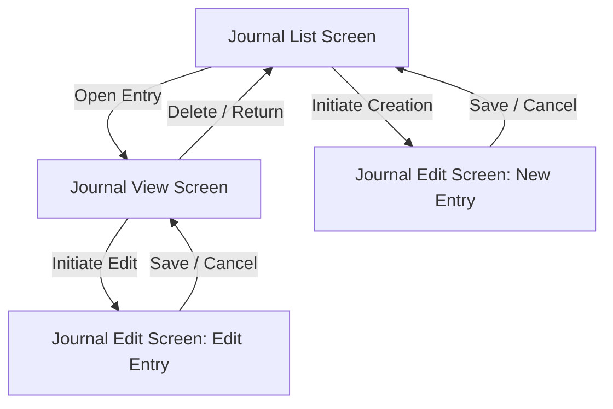

# Peejays - User Experience & Functionality Specification

This document defines the functional capabilities, user interactions, and core features of **Peejays**, a simple personal journaling application (named after the pronunciation of the acronym "PJ" for personal journal).

---

## 1. Application Navigation & State Flow

Peejays is structured around a three-screen workflow focused on searching, reading, composing, and managing journal entries:

- **Journal List Screen**: The default screen. It lists saved entries and provides tools for sorting, searching, quick mood-filtering, and navigating to read or create entries.
- **Journal View Screen**: A dedicated read-only screen that displays the full content of a selected journal entry, including tags, attached images, location, and favorite status.
- **Journal Edit Screen**: A dedicated form-based screen used for composing new journal entries or updating existing ones with title, date, text body, location, mood, tags, and image attachments.

---

## 2. Screen Capabilities

### Screen 1: Journal List Screen
Provides the primary features for finding, viewing, filtering, and organizing journal entries.

#### Features & Functionality
- **App Header**:
  - Displays the app name "Peejays" with the subtitle "Your life, one page at a time."
  - Displays the user's initials avatar (e.g., "JD") linking to personal profile/settings.
- **Quick Mood/Tag Filter**:
  - Horizontal scrollable filter pills (e.g., "All", "Joyful", "Reflective") at the top of the feed.
  - Tapping a pill instantly filters the journal feed to entries containing that specific mood or tag.
- **Recent Entries Chronological Feed**:
  - Lists all journal entries matching active filters. Each entry card displays:
    - **Date**: The publication date of the entry (e.g., "October 24, 1974").
    - **Title**: The entry's headline.
    - **Mood Tag**: Displayed next to the title as a pill with a representative icon (e.g., a smile/pensive face).
    - **Optional Image Attachment**: A landscape-oriented photo preview if an image is attached to the entry.
    - **Content Preview**: A snippet of the body text (truncated with an ellipsis).
    - **Location**: Displayed at the bottom of the card with a map pin icon (e.g., "Brooklyn, NY").
    - **Read Arrow**: Tap indicator to open the entry.
- **Search & Filter Functionality**:
  - **Interaction**: Real-time client-side filter via a search input field ("Search your memories...").
  - **Search Scope**: Matches text against the entry's title, body content, location, mood, and tags.
- **Entry Creation Trigger**:
  - A bottom right action button ("New Entry") that redirects the user to the **Journal Edit Screen** in creation mode.

---

### Screen 2: Journal View Screen
Supports immersive reading of a specific journal entry, favoriting, and lifecycle management.

#### Features & Functionality
- **Header Actions**:
  - **Back Navigation**: Returns the user to the Journal List Screen.
  - **Metadata Display**: Displays the entry date (e.g., "OCTOBER 24, 1994") and the entry number/identifier (e.g., "Entry #442") centered in the app bar.
  - **Options Menu**: A three-dot menu button providing entry operations (e.g., delete entry with confirmation safety dialog).
- **Entry View Card**:
  - Displays the entry's location with a map pin icon (e.g., "The Old Library, Rainy Day").
  - Large title headline followed by a horizontal divider line.
  - Full-text journal content body using readable typography and comfortable line heights.
  - Landscape image attachment displayed at the bottom of the content canvas.
- **Bottom Actions Bar**:
  - **Edit Thoughts Button**: Wide button navigating to the **Journal Edit Screen** to modify the entry.
  - **Favorite (Heart Button)**: A toggle button represented by a heart icon to mark or unmark the entry as a favorite.

---

### Screen 3: Journal Edit Screen
Provides a structured writing canvas for composing new journal entries and updating existing ones.

#### Features & Functionality
- **App Bar**:
  - **Cancel (Close/X Button)**: Discards changes and exits the editor.
  - **Save Button**: Validates inputs, updates timestamps, commits changes, and returns the user to the View Screen (or List Screen if new).
- **Writing Canvas & Form Fields**:
  - **Title Field**: Framed card labeled "TITLE" containing a text input field ("A name for this moment..."). *Validation*: Cannot be empty.
  - **Date Selector**: Row displaying the entry's date with calendar icons and an edit date button to open a date picker dialog.
  - **Journal Body Field**: Framed card labeled "DEAR DIARY..." with a textured writing canvas and a multi-line, auto-growing text input.
  - **Mood & Tags Section**: Framed card labeled "MOOD & TAGS" displaying active tag chips (with representative icons, e.g. "Melancholy" with a cloud, "Reflective" with a book) and a "+" button to append new ones.
  - **Image Preview**: Displays a landscape preview of the attached photo (labeled with its filename, e.g., "IMG_0442.JPG").
- **Bottom Toolbar & Statistics**:
  - **Media & Tag Shortcuts**: Direct buttons to attach an image from the local gallery, record/dictate audio notes, or edit tags.
  - **Word Counter**: Real-time word count metric (e.g., "142 words") shown on the bottom right with a editing/status indicator.

---

## 3. User Interaction Workflows

### Flow A: Creating a New Journal Entry
1. From the List Screen, the user taps the **New Entry** button.
2. The user is redirected to the Edit Screen with blank inputs.
3. The user inputs a title, optional content, date, tags/moods, and attaches an optional image.
4. The user taps **Save**. If validation succeeds, the entry is created, saved locally, and the user returns to the List Screen.

### Flow B: Searching and Filtering
1. From the List Screen, the user taps a mood/tag quick filter pill (e.g., "Reflective") or types a term in the search bar.
2. The list updates instantly to show only matching entries.
3. The user can clear the search or select the "All" pill to restore the full chronological feed.

### Flow C: Modifying an Entry
1. From the List Screen, the user selects and opens an entry.
2. The user reads the entry on the View Screen and taps **Edit Thoughts**.
3. The user is redirected to the Edit Screen, pre-populating fields with the entry's current data.
4. The user modifies the desired fields (title, date, body, tags, location, or image) and taps **Save**.
5. The entry is updated, and the user is returned to the View Screen showing the updated content.

### Flow D: Favoriting an Entry
1. From the List Screen, the user opens an entry.
2. On the View Screen, the user taps the **Heart Button** in the bottom action bar.
3. The heart icon toggles its state (filled vs. outline), and the provider updates the entry's favorite status in the database/JSON layer.
