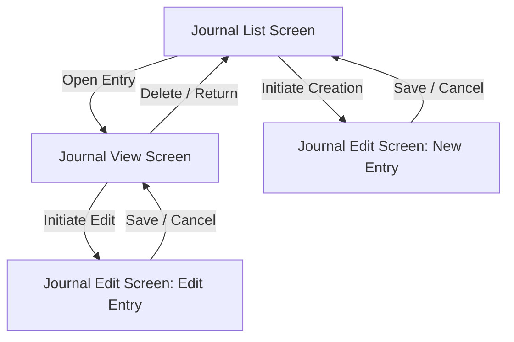

# Peejays - User Experience & Functionality Specification

This document defines the functional capabilities, user interactions, and core features of **Peejays**, a simple personal journaling application (named after the pronunciation of the acronym "PJ" for personal journal).

---

## 1. Application Navigation & State Flow

Peejays is structured around a three-screen workflow focused on searching, reading, and editing journal entries:

- **Journal List Screen**: The default screen. It lists saved entries and provides tools for sorting, searching, and navigating to read or create entries.
- **Journal View Screen**: A dedicated read-only screen that displays the full content of a selected journal entry.
- **Journal Edit Screen**: A dedicated form-based screen used for composing new journal entries or updating existing ones.

---

## 2. Screen Capabilities

### Screen 1: Journal List Screen
Provides the primary features for finding, viewing, and organizing journal entries.

#### Features & Functionality
- **Chronological Feed**: Lists all journal entries. Each item summarizes:
  - Entry title.
  - Date the entry was created.
  - Content preview (first few sentences).
  - Associated tags.
- **Search & Filter Functionality**:
  - **Interaction**: The user can filter the list in real-time by entering text in a search input.
  - **Search Scope**: The search matches the input text against:
    - The entry's title.
    - The entry's content body.
    - Any tags associated with the entry.
  - **Matching Behavior**: Case-insensitive substring matching (e.g., searching "travel" matches entries with title "My Travel", content "I love to travel", or the tag "travel").
- **Sorting Options**:
  - Allows the user to reorder the displayed list of entries based on the following criteria:
    - **Newest First** (Default): Orders entries by creation date in descending order.
    - **Oldest First**: Orders entries by creation date in ascending order.
    - **Title A-Z**: Orders entries alphabetically by title in ascending order.
    - **Title Z-A**: Orders entries alphabetically by title in descending order.
- **Entry Creation Trigger**:
  - Provides a single action to initiate the creation of a new journal entry, which immediately redirects the user to the **Journal Edit Screen**.
- **Empty State**:
  - When no journal entries exist or when the search query returns zero results, the app displays a clear message indicating that no entries match the criteria.

---

### Screen 2: Journal View Screen
Supports immersive reading of a specific journal entry and managing its lifecycle (edit trigger/deletion).

#### Features & Functionality
- **Detailed Display**: Shows the full title, date created, last modified date (if updated), all associated tags, and the complete body text of the entry.
- **Edit Action**: Allows the user to open the current entry in the **Journal Edit Screen**.
- **Delete Functionality**:
  - Allows the user to delete the current entry.
  - **Safety Check**: Requires the user to confirm deletion via a confirmation dialog before removing the data.
- **Return Action**: Permits the user to return to the Journal List Screen.

---

### Screen 3: Journal Edit Screen
Provides the input framework for creating new entries and modifying existing ones.

#### Features & Functionality
- **Input Fields**:
  - **Title Field**: Allows editing the title.
    - *Validation*: A title is required. The system will prevent saving if this field is empty.
  - **Content Body Field**: A multi-line input field for writing the journal text.
  - **Tags Field**: Allows associating multiple keyword tags with the entry.
- **Save Action**:
  - Validates constraints (e.g., verifying that the title is not empty).
  - Updates the `updatedAt` timestamp.
  - Commits the changes to the persistence layer.
  - Returns the user to the **Journal View Screen** (if editing an existing entry) or the **Journal List Screen** (if saving a newly created entry).
- **Cancel Action**:
  - Discards any changes made during the editing session.
  - Returns the user to the previous screen (either **Journal View Screen** or **Journal List Screen**) without modifying the data store.

---

## 3. User Interaction Workflows

### Flow A: Creating a New Journal Entry
1. From the List Screen, the user triggers the creation action.
2. The user is redirected to the Edit Screen (New Entry state) with blank inputs.
3. The user inputs a title, optional content, and optional tags.
4. The user saves the entry. If validation succeeds, the entry is created, and the user is redirected to the List Screen.

### Flow B: Searching and Filtering
1. From the List Screen, the user activates search and inputs a term.
2. The list updates instantly to show only matching entries.
3. Clearing the input returns the list to its full state.

### Flow C: Modifying an Entry
1. From the List Screen, the user selects and opens an entry.
2. The user reads the entry on the View Screen and selects the edit action.
3. The user is redirected to the Edit Screen, pre-populating fields with the entry's existing data.
4. The user modifies the desired fields and saves.
5. The entry is updated, and the user is returned to the View Screen showing the updated content.
